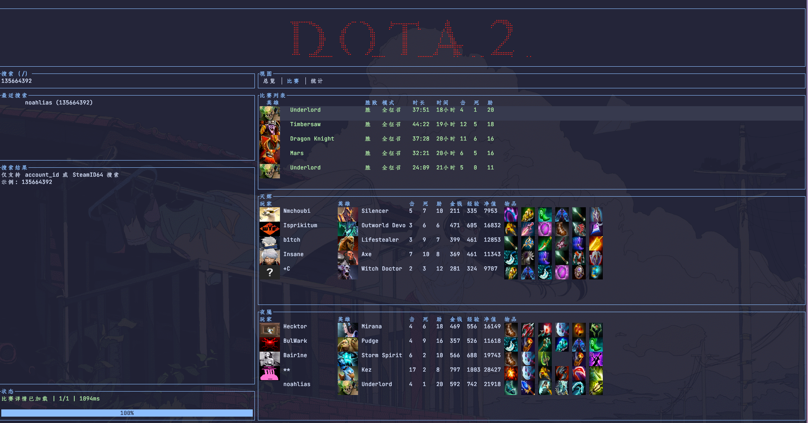

# dota2_tui

A Rust TUI for exploring Dota 2 player data using the OpenDota API.



## Features

- Search by account_id or SteamID64
- Recent matches with details
- Tabs for overview, matches, and stats
- Optional avatar, hero, and item images (Kitty/iTerm2/WezTerm/Ghostty)
- Configurable keybinds and theme

## Requirements

- Rust toolchain (stable)
- Terminal that supports images (optional): Kitty, iTerm2, WezTerm, or Ghostty

## Build & Run

```bash
cargo build
cargo run
```

## Release Build

```bash
cargo build --release
```

## CI

GitHub Actions builds on Linux/macOS/Windows for every push and PR.

## Configuration

Config is stored in the OS user config directory:

- macOS: `~/Library/Application Support/dota2_tui/config.toml`
- Linux: `~/.config/dota2_tui/config.toml`
- Windows: `%APPDATA%\\dota2_tui\\config.toml`

A full example is in `examples/config.toml`. Copy it into your config path and edit.

### API settings

- `rate_limit_per_minute`: default 60 for OpenDota free tier
- `cache_ttl_secs`: cache duration for API responses
- `cache_max_entries`: max cached responses
- `max_inflight`: max concurrent API requests
- `log_requests`: write API timings and errors to `tui.log` in the config dir (default: true)

### Images

- `protocol`: `auto`, `kitty`, `iterm2`, or `none`
- `cdn_base`: base URL for hero/item icons
  - Image bytes are cached to disk under the OS cache dir (`dota2_tui/images`).

### Language

- `ui.language`: `en` or `zh-CN`
  - Default: `zh` (Chinese)

### Keybinds

All keybinds are configurable; press `?` in the TUI for the cheatsheet popup.

## Contributing

- Keep modules small and focused (`api`, `app`, `ui`, `input`, `image`)
- Avoid blocking calls on the async runtime
- Run `cargo fmt` and `cargo clippy` before submitting
- Keep diffs minimal and remove unused code

## Troubleshooting

If requests seem slow, API logging is on by default:

```toml
[api]
log_requests = true
```

Then check `tui.log` in the config directory.

## Memory & Performance

### Quick RSS check (macOS/Linux)

```bash
ps -o pid,rss,command -p $(pgrep -f dota2_tui)
```

### Run with a memory profiler

- macOS: Instruments (Allocations)
- Linux: `heaptrack` or `valgrind --tool=massif`

These tools help verify that image caches and network requests are not leaking over time.

## TODO

- Fix UI block sizing issues (panels overflowing or clipping).
- Resolve avatar overlap in all panels and tables.
- Improve overall UI layout, spacing, and visual hierarchy.
- Add smoother animations and interaction polish.

### Recent searches

Recent searches are appended to `recent.jsonl` in the config directory. The UI shows the latest 5 entries.

## API Debug Tests

Live API checks are gated to avoid flaky CI runs. Set `OPENDOTA_LIVE=1` to run:

```bash
OPENDOTA_LIVE=1 cargo test --test opendota_live
```

Optional overrides:

- `OPENDOTA_ACCOUNT_ID`: account_id to query (default: 135664392)
- `OPENDOTA_BASE_URL`: custom API base URL (default: https://api.opendota.com/api)
